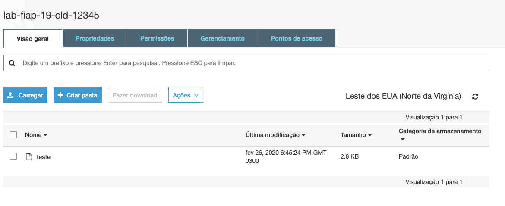

1. Execute o comando `cd ~/environment/Hackaton-exercises-terraform/demos/State/` para entrar na pasta do exercicío.'
2. Entre na pasta 'S3' com o comando `cd S3`
3. Execute o comando `terraform init`
4. Utilizando o IDE altere o aquivo 's3.tf' que esta em 'fiap-devops-orquestracao/IaC\ -\ Terraform/demos/State/S3'. Coloque sua turma e seu rm noo locais indicados. Sem espaços e letras maiúsculas. Isso é necessário pois os nomes de buckets são unicos em toda a AWS não só em sua conta. 
5. Execute o comando `terraform apply -auto-approve`
6. Você acabou de criar o bucket que lhe servirá de estado remoto
7. Saia da pasta com `cd ..`
8. Entre na pasta 'test' com o comando `cd test`
9.  Utilizendo o IDE altere o arquivo state.tf que esta no diretório '/Hackaton-exercises-terraform/demos/State/test'. No campo bucket coloque o mesmo nome que utilizou para criar o bucket acima.
10. Utilize o comando `terraform init` para sincronizar com o estado remoto
11. Execute o comando `terraform apply -auto-approve`
12. Se for agora no bucket do S3 que criou para o exercicio você poderá ver que foi criado um arquivo com o nome teste. Nele constam todas as indormações de tudo que o terraform executou dentro da pasta test. Verifique baixando o arquivo e lendo.
    
13. Execute o comando `rm -rf .terraform` para remover todos os arquivos de estado local do terraform
14. Execute novamente `terraform init`, dessa vez além de baixar os plugins e providers também baixou o ultimo estado da sua infraestrutura.
15. Execute o comando `terraform apply -auto-approve`. Note que nada foi alterado ou adiiconado já que sua maquina ainda esta disponivel e o terraform descobriu isso via estado remoto.
    
16. Execute o comando `terraform destroy -auto-approve`
